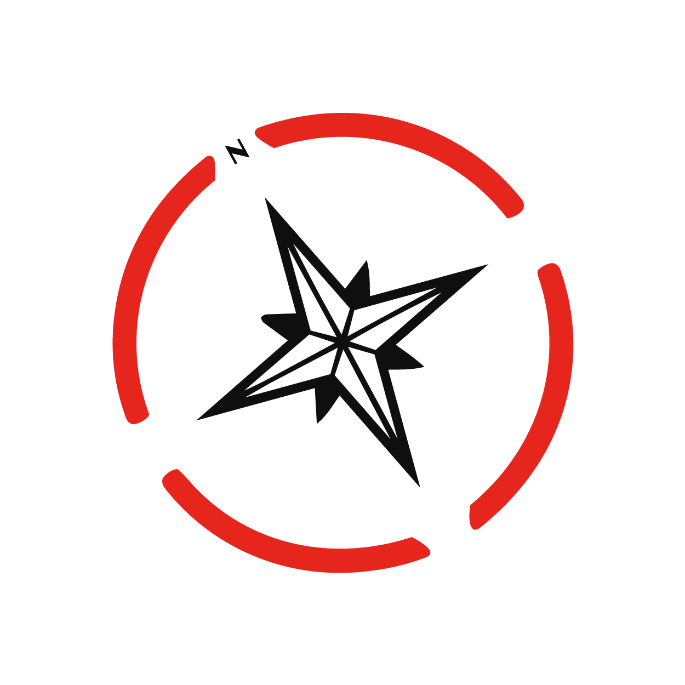

<a href="index.html" class="brand">NORTHI<strong>A</strong></a>

[从亚洲走向世界](asia-to-world-marketing-zh-cn.html)[从世界走进亚洲](asia-market-entry-marketing-zh-cn.html)[KOL／达人营销](kol-influencer-marketing-asia-zh-cn.html)[社群营销](community-marketing-services-zh-cn.html)[关于我们](index.html#about)

<a href="japan-market-entry-marketing.html" hreflang="en">EN</a><a href="japan-market-entry-marketing-zh-hk.html" hreflang="zh-Hant">繁中</a><a href="japan-market-entry-marketing-zh-cn.html" class="on" hreflang="zh-Hans">简中</a>

<a href="mailto:hello@northiamarketing.com" class="cta-small">预约策略沟通 →</a>

[从亚洲走向世界](asia-to-world-marketing-zh-cn.html)<a href="asia-market-entry-marketing-zh-cn.html" class="on">从世界走进亚洲</a>

从世界走进亚洲 · 日本

# 想进入日本市场，先别急着投广告。

Northia 从市场判断、品牌定位和本地化开始，再安排 KOL／达人、内容和社群。目标不是“上线了”，而是让日本用户真的看懂、相信、愿意买。

<a href="mailto:hello@northiamarketing.com" class="btn dark">聊聊你的目标市场</a><a href="asia-market-entry-marketing-zh-cn.html" class="btn">先选你要进入的市场</a>

先做市场诊断，再决定怎么投

## 日本不是区域模板，照搬内容很难跑通。

日本用户不太吃“喊得响”这一套。他们更看细节、稳定服务和本地可信度。不是把英文翻成日文就能卖，而是要把信任重新做一遍。

Northia 能帮你做什么

## 从看懂市场，到把内容和达人真正跑起来。

01

### 先把用户和竞品看清楚

看需求、竞品、人群、文化门槛和最值得先做的机会。

02

### 重新说清楚你是谁

按日本用户的语言、信任点和购买路径重做表达。

03

### KOL／达人营销

日文搜索、LINE、X、YouTube、本地媒体和真正匹配的达人。

先选你要进入的市场

## 还想看哪个亚洲市场？

[日本 →](japan-market-entry-marketing-zh-cn.html)[中国大陆 →](mainland-china-market-entry-marketing-zh-cn.html)[中国香港 →](hong-kong-market-entry-marketing-zh-cn.html)[中国台湾 →](taiwan-market-entry-marketing-zh-cn.html)[新加坡 →](singapore-market-entry-marketing-zh-cn.html)[马来西亚 →](malaysia-market-entry-marketing-zh-cn.html)[韩国 →](south-korea-market-entry-marketing-zh-cn.html)[越南 →](vietnam-market-entry-marketing-zh-cn.html)[泰国 →](thailand-market-entry-marketing-zh-cn.html)

<a href="index.html" class="brand">NORTHI<strong>A</strong></a>

亚洲 ⇄ 海外｜品牌增长、市场进入与社群营销顾问。

#### 先选你要进入的市场

[从亚洲走向世界](asia-to-world-marketing-zh-cn.html)[从世界走进亚洲](asia-market-entry-marketing-zh-cn.html)[KOL／达人营销](kol-influencer-marketing-asia-zh-cn.html)[社群营销](community-marketing-services-zh-cn.html)

#### Contact

<hello@northiamarketing.com>[+1 778-998-5022](tel:+17789985022)

#### 关注 Northia

<a href="https://www.instagram.com/northiamarketing/" rel="noopener noreferrer" target="_blank">Instagram</a><a href="https://www.linkedin.com/company/northia-marketing-consultancy/" rel="noopener noreferrer" target="_blank">LinkedIn</a><a href="http://xhslink.com/o/2T26xDWQywT" rel="noopener noreferrer" target="_blank">小红书</a>

© 2026 Northia Marketing Consultancy Ltd. · Canada

